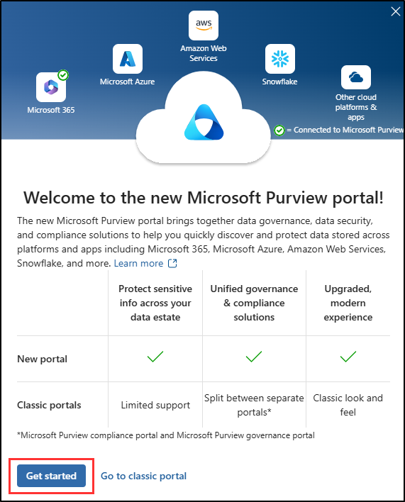
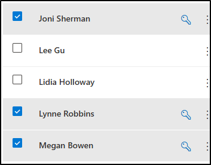

---
lab:
  title: ラボのセットアップ - 管理環境を準備する
  module: Lab setup
---

## WWL テナント - 使用条件

講師が指導するトレーニング配信の一環としてテナントを提供されている場合は、講師が指導するトレーニングでハンズオンラボをサポートする目的でテナントを利用できることに注意してください。

テナントを共有したり、ハンズオンラボ以外の目的で使用したりしないでください。 このコースで使われるテナントは試用版テナントであり、クラスが終了し、拡張機能の対象となっていない場合は、使用したりアクセスしたりすることはできません。

テナントを有料サブスクリプションに変換することはできません。 このコースの一環として取得したテナントは Microsoft Corporation の財産のままであり、当社はいつでもアクセス権とリポジトリを取得する権利を留保します。

# ラボのセットアップ - 管理環境を準備する

このラボでは、管理タスク用に環境を構成して準備します。 必要な機能をアクティブ化し、管理アクセス許可を設定し、主要な要素を適切に構成します。

**タスク**:

1. Microsoft Purview ポータルで監査を有効にする
1. ラボ演習のユーザー パスワードを設定する
1. デバイスのオンボードを有効にする
1. インサイダー リスク分析を有効にする

## タスク 1 - Microsoft Purview ポータルで監査を有効にする

このタスクでは、Microsoft Purview ポータルで監査を有効にして、ポータル アクティビティを監視します。

1. Client 1 VM (SC-401-CL1) には引き続き **SC-401-CL1\admin** アカウントでログインし、Microsoft 365 には MOD 管理者アカウントでログインしている必要があります。

1. マウスの右ボタンで Windows ボタンを選択して管理者特権のターミナル ウィンドウを開き、**[ターミナル (管理者)]** を選択します。

1. ターミナル ウィンドウで**モジュールのインストール** コマンドレットを実行して、最新の **Exchange Online PowerShell** モジュール バージョンをインストールします。

    ```powershell
    Install-Module ExchangeOnlineManagement
    ```

1. NuGet プロバイダープロンプトで、「はい」を示す「**Y**」を入力し、**Enter** キーを押します。

1. 信頼されていないレポジトリ セキュリティ ダイアログで、[はい] を示す **[Y]** を選択して確定し、**Enter** キーを押します。  この処理は、完了までに時間がかかる場合があります。

1. **Set-ExecutionPolicy** コマンドレットを実行して、実行ポリシーを変更し、**Enter** キーを押します。

    ```powershell
    Set-ExecutionPolicy -ExecutionPolicy RemoteSigned -Scope CurrentUser
    ```

1. PowerShell ウィンドウを閉じます。

1. タスク バーの Windows ボタンを右クリックして、管理者特権以外の通常の PowerShell ウィンドウを開き、**[ターミナル (管理者)]** を選択します。

1. **Connect-ExchangeOnline** コマンドレットを実行し、Exchange Online PowerShell モジュールを使用してテナントに接続します。

    ```powershell
    Connect-ExchangeOnline
    ```

1. **[サインイン]** ウィンドウが表示されたら、`admin@WWLxZZZZZZ.onmicrosoft.com` としてサインインします (ZZZZZZ はラボ ホスティング プロバイダーから支給された固有のテナント ID)。 管理者のパスワードは、ラボ ホスティング プロバイダーから支給されます。

1. 監査が有効になっているかどうかを確認するには、**Get-AdminAuditLogConfig** コマンドレットを実行します。

    ```powershell
    Get-AdminAuditLogConfig | FL UnifiedAuditLogIngestionEnabled
    ```

1. _UnifiedAuditLogIngestionEnabled_ が false を返す場合、監査は無効になっています。

1. 監査ログを有効にするには、**Set-AdminAuditLogConfig** コマンドレットを実行し、**UnifiedAuditLogIngestionEnabled** を _true_ に設定します。

    ```powershell
    Set-AdminAuditLogConfig -UnifiedAuditLogIngestionEnabled $true
    ```

1. 監査が有効になっていることを確認するには、**Get-AdminAuditLogConfig** コマンドレットをもう一度実行します。

    ```powershell
    Get-AdminAuditLogConfig | FL UnifiedAuditLogIngestionEnabled
    ```

1. _UnifiedAuditLogIngestionEnabled_ から _true_ が返され、監査が有効になっていることがわかります。

<!---

1. In Microsoft Edge, navigate to the Microsoft Purview portal, `https://purview.microsoft.com`, and log in.

1. A message about the new Microsoft Purview portal will appear on the screen. Select the option to agree with the terms of data flow disclosure and the privacy statement, then select **Try now**.

    

1. Select **Solutions** from the left sidebar, then select **Audit**.

1. On the **Search** page, select the **Start recording user and admin activity** bar to enable audit logging.

    

1. Once you select this option, the blue bar should disappear from this page.

-->

## タスク 2 - ラボ演習のユーザー パスワードを設定する

このタスクでは、ラボに必要なユーザー アカウントのパスワードを設定します。

1. **SC-401-CL1\admin** アカウントを使って Client 1 VM (SC-401-CL1) にログインします。 パスワードは、ラボ ホスティング プロバイダーから支給されます。

1. **Microsoft Edge** を開き、**`https://admin.microsoft.com`** にアクセスし、Microsoft 365 管理センターに MOD 管理者 `admin@WWLxZZZZZZ.onmicrosoft.com` としてログインします (ここで ZZZZZZ はラボ ホスティング プロバイダーから支給された一意のテナント ID です)。

1. 左側のナビゲーション ウィンドウで **[ユーザー]** を展開し、**[アクティブ ユーザー]** を選びます。

1. **[Joni Sherman]**、**[Lynne Robbins]**、および **[Megan Bowen]** の左側にあるチェックボックスをオンにします。

   これらのアカウントは、ラボ演習を終了するまで使用します。

   

1. 上部のナビゲーションから **[パスワードのリセット]** ボタンを選択し、3 つのパスワードをすべてリセットします。

   ![Microsoft 365 管理センターの [パスワードのリセット] ボタンを示すスクリーンショット。](../Media/reset-password-button.png)

1. 右側の **[パスワードのリセット]** ポップアップ ページで、両方のチェックボックスがオフになっていることを確認します。

   この結果、演習に使用する 3 人のユーザーのパスワードを選択できるようになり、最初にサインインするときにこれらのパスワードをリセットする必要がなくなります。

1. "**パスワード**" フィールドに、今後の演習で使用するユーザー パスワードをリセットするための覚えやすいパスワードを入力します。

1. **[パスワードのリセット]** ポップアップ ページの下部で、**[パスワードのリセット]** ボタンを選択します。

1. **[パスワードがリセットされました]** ページに、リセットされた 3 つのユーザー アカウントが表示されているはずです。 このポップアップ ページの下部にある **[閉じる]** を選択します。

ラボ演習のパスワードが正常にリセットされました。

## タスク 3: デバイスのオンボードを有効にする

このタスクでは、組織向けにデバイスのオンボードを有効にします。

1. Client 1 VM (SC-401-CL1) には引き続き **SC-401-CL1\admin** アカウントでログインし、Microsoft 365 には MOD 管理者アカウントでログインしている必要があります。

1. **Microsoft Edge** で、**`https://purview.microsoft.com`** に移動して Microsoft Purview にログインし、左側のサイド バーから **[設定]** を選択します。

1. 左サイドバーで、**[デバイスのオンボード]** を展開し **[デバイス]** を選択します。

1. **[デバイス]** ページで **[デバイスのオンボードを有効にする]** を選択し、**[OK]** を選択してデバイスのオンボードを有効にします。

1. プロンプトが表示されたら、**[OK]** を選択して、デバイスの監視が有効になっていることを確認します。

これでデバイスのオンボーディングが有効となりました。デバイスをエンドポイント DLP ポリシーで保護するためにオンボードを開始できます。 この機能を有効にするプロセスには、最大 30 分かかる場合があります。

## タスク 4 - インサイダー リスク分析を有効にする

このタスクでは、インサイダー リスク管理の分析を有効にします。

1. Client 1 VM (SC-401-CL1) には引き続き **SC-401-CL1\admin** アカウントでログインし、Microsoft Purview には MOD 管理者アカウントでログインしている必要があります。

1. Microsoft Purview で、**[設定]** > **[インサイダー リスク管理]** > **[分析]** に移動します。

1. **[分析]** を **[オン]** に切り替え、**[保存]** を選択します。

インサイダー リスク管理の分析を有効にしました。

## タスク 5 - Microsoft Defender XDR を初期化する

このタスクでは、Microsoft Defender を開き、Microsoft Defender XDR の初期化が完了するまで待機します。

1. Client 1 VM (SC-401-CL1) には引き続き **SC-401-CL1\admin** アカウントでログインし、Microsoft Purview には MOD 管理者アカウントでログインしている必要があります。

1. **Microsoft Edge** で、**`https://security.microsoft.com/`** に移動して Microsoft Defender を開きます。

1. ナビゲーション ウィンドウで、**[調査と対応]** > **[インシデントとアラート]** > **[インシデント]** を選択します。

1. Microsoft Defender XDR が準備中であることを示すメッセージが表示されます。 このプロセスは自動的に実行され、数分かかる場合があります。

   

Microsoft Defender XDR を初期化しています。 セットアップが完了するまで、他のタスクを続行できます。
