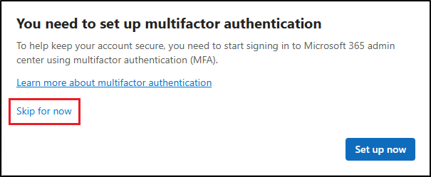

---
lab:
  title: 演習 1 - コンプライアンス ロールとセキュリティ ロールを管理する
  module: Module 1 - Implement Information Protection
---
## WWL テナント - 使用条件

講師が指導するトレーニング配信の一環としてテナントを提供されている場合は、講師が指導するトレーニングでハンズオンラボをサポートする目的でテナントを利用できることに注意してください。

テナントを共有したり、ハンズオンラボ以外の目的で使用したりしないでください。 このコースで使われるテナントは試用版テナントであり、クラスが終了し、拡張機能の対象となっていない場合は、使用したりアクセスしたりすることはできません。

テナントを有料サブスクリプションに変換することはできません。 このコースの一環として取得したテナントは Microsoft Corporation の財産のままであり、当社はいつでもアクセス権とリポジトリを取得する権利を留保します。

# ラボ 1 - 演習 1 - コンプライアンス ロールとセキュリティ ロールを管理する

Contoso Ltd. の最近採用された情報セキュリティ管理者として、Joni Sherman は、新しい Microsoft 365 テナントがさまざまな法的および規制基準に準拠していることを確認する必要があります。 Contoso Ltd. は拡大しており、そのリージョンでコンプライアンスを維持する上で、あなたの役割が不可欠です。

**タスク**:

1. 管理者ロールを割り当てる
1. Microsoft Purview ポータルについて調べる

## タスク 1 - 管理者ロールを割り当てる

このタスクでは、必要なコンプライアンスおよびセキュリティ ロールを Joni Sherman に割り当てます。

1. Client 1 VM (SC-401-CL1) に **SC-401-CL1\admin** アカウントでログインします。 パスワードは、ラボ ホスティング プロバイダーから支給されます。

1. **Microsoft Edge** を開き、Microsoft 365 管理センター (`https://admin.microsoft.com`) に移動して、**MOD 管理者**である `admin@WWLxZZZZZZ.onmicrosoft.com` としてログインします (この ZZZZZZ は、ラボ ホスティング プロバイダーから提供された自分専用のテナント プレフィックスです)。 管理者のパスワードは、ラボ ホスティング プロバイダーから支給されます。

    > [!Note] **注:Microsoft 365 管理センターの MFA をスキップする**
    >
    > 一部のテナントでは、サインイン時にポータルの MFA 適用に関するプロンプトが表示される場合があります。 このメッセージが表示される場合:
    >
    > - MFA のセットアップを一時的に延期するには、**[今はしない]** を選択します。
    >
    >    
    >
    > - **[MFA をスキップする理由をお聞かせください]** ダイアログでいずれかの理由を選択して、**[送信してスキップ]** を選択します。
    >
    > これにより、Microsoft 365 管理センターでこのテナントに対する MFA の適用が延期され、ラボを続行できます。

1. 左サイドバーで **[ユーザー]** を展開し、**[アクティブ ユーザー]** を選びます。

1. **[アクティブ ユーザー]** ページで、`Joni` を検索し、**Joni Sherman** を選択します。

1. Joni のアカウントのプロパティは、右側のポップアップ パネルに表示されます。 ポップアップ パネルで **[役割の管理]** を選択します。

1. **[管理者の役割の管理]** パネルで、**[管理センターに対するアクセス許可]** を選択し、下にスクロールして **[すべてをカテゴリ別に表示]** を選択します。

1. **[Security & Compliance]** カテゴリで、**[コンプライアンス管理者]**、**[セキュリティ管理者]**、**[アプリケーション管理者]** のチェックボックスをオンにし、ポップアップ パネルの下部にある **[変更の保存]** を選択します。

1. 次のメッセージが表示されます: **管理者の役割が更新されました**

1. **[管理者の役割の管理]** ページで、ポップアップ パネルの右上隅にある **X** を選択してパネルを閉じます。

1. 右上隅の **MA** アイコンを選択して MOD 管理者アカウントからサインアウトし、**[サインアウト]** を選択します。

   

このラボで演習の実施が求められているコンプライアンス管理者ロールとセキュリティ管理者ロールが、Joni Sherman に割り当てられました。

## タスク 2 – Microsoft Purview ポータルについて調べる

このタスクでは、Joni Sherman としてサインインして、Microsoft Purview ポータルを探索します。

1. Client 1 VM (SC-401-CL1) に **SC-401-CL1\admin** アカウントでログインしている必要があります。

1. **Microsoft Edge** で、 **`https://purview.microsoft.com`** に移動します。

1. **[アカウントを選択]** ウィンドウが表示されたら、**[別のアカウントを使用]** を選択します。

1. **[サインイン]** ウィンドウが表示されたら、`JoniS@WWLxZZZZZZ.onmicrosoft.com` としてサインインします (この ZZZZZZ は、ラボ ホスティング プロバイダーから提供された自分専用のテナント プレフィックスです)。 ユーザー アカウントのパスワードは、ラボ ホスティング プロバイダーから提供されます。

1. 新しい Microsoft Purview ポータルに関するメッセージが画面に表示されます。 **[はじめに]** を選択して、新しいポータルにアクセスします。

1. 新しい Microsoft Purview ポータルについて理解します。 終了したら、ブラウザーの画面を開いたままにしておきます。

Joni Sherman のアカウントへの切り替えが完了し、ラボを開始する準備ができました。
