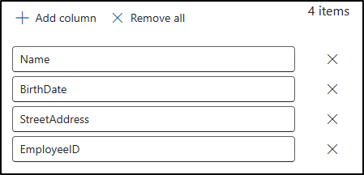

---
lab:
  title: 演習 2 - 機密情報の種類を作成および管理する
  module: Module 1 - Implement Information Protection
---


# ラボ 1 - 演習 2 - 機密情報の種類を作成および管理する

Contoso Ltd. の情報セキュリティ管理者である Joni Sherman は、サポート チケットでの個人データの意図しない共有に関する以前のインシデントの後、組織の情報保護戦略を更新しています。 これには、従業員 ID とドキュメントや電子メール内の個人の健康情報への参照を検出するのに役立つカスタムの機密情報の種類を作成してテストする必要があります。

**タスク**:

1. タスク 1 - カスタム機密情報の種類を作成する
1. 誤検知を減らすために信頼度レベルを変更する
1. セキュリティ グループを作成してロールを割り当て、EDM 分類子を作成する
1. EDMベースの分類情報の種類を作成する
1. EDM ベースの分類データ ソースを作成する
1. キーワード辞書を作成する
1. カスタム機密情報の種類をテストする

## タスク 1 - カスタム機密情報の種類を作成する

このタスクでは、キーワード "Employee" と "ID" の近くにある従業員 ID のパターンを認識するカスタムの機密情報の種類を新しく作成します。

1. 引き続き Client 1 VM (SC-401-CL1) に **SC-401-CL1\admin** アカウントでログインしている必要があります。

1. **Microsoft Edge** で、 **`https://purview.microsoft.com`** に移動し、Microsoft Purview ポータルに `JoniS@WWLxZZZZZZ.onmicrosoft.com` としてログインします (ZZZZZZ はラボ ホスティング プロバイダーから支給された固有のテナント ID)。 Joni のパスワードは、前の演習で設定しました。

1. 左サイドバーで **[ソリューション]** を選択し、**[Microsoft Information Protection]** を選択します。

1. 左サイドバーで、**[分類子]** を展開し、**[機密情報の種類]** を選択します。

1. **[機密情報の種類]** ページで、**[+ 機密情報の種類を作成する]** を選択し、機密情報の種類の構成を開始します。

1. **[機密情報の種類に名前を付けます]** ページで、次のように入力します。

    - **名前**: `Contoso Employee IDs`
    - **説明**: `Pattern for Contoso employee IDs.`

1. [**次へ**] を選択します。

1. **[この機密情報の種類のパターンを定義する]** ページで、**[パターンを作成する]** を選択します。

1. 右側の **[新しいパターン]** ポップアップ パネルで、**[+ 主要要素を追加する]**  >  **[正規表現]** を選択します。

1. 右側の **[+ 正規表現を追加する]** ポップアップ パネルで、次のように入力します。

   - **ID**: `Contoso IDs`
   - **正規表現**: `[A-Z]{3}[0-9]{6}`
   - _文字列の一致_ のラジオ ボタンを選択します。

1. ポップアップ パネルの下部にある **[完了]** を選択します。

1. **[新しいパターン]** ポップアップ パネルに戻り、**[補助要素]** で、**[+ 補助要素または要素のグループを追加]** ドロップダウン メニューを選択し、**[キーワードのリスト]** を選択します。

1. 右側の **[キーワード リストの追加]** ポップアップ パネルで、次のように入力します。

   - **ID**: `Employee ID keywords`
   - **大文字と小文字の区別をしない**:

      ```text
      Employee
      ID
      ```

   - _単語の一致_ のラジオ ボタンを選択する

1. ポップアップ パネルの下部にある **[完了]** を選択します。

1. **新しいパターン**ポップアップ パネルに戻り、**[文字の近接度]** で、**[次の範囲内で、主要要素および補助要素を検出する]** の値を 100 文字に減らします。

1. ポップアップ パネルの下部にある **[作成]** ボタンを選択します。

1. **[この機密情報の種類のパターンを定義する]** ページに戻り、 **[次へ]** を選択します。

1. **[コンプライアンス ポリシーに表示する推奨の信頼度レベルを選択する]** ページで、既定値を使用して **[次へ]** を選択します。

1. **[設定を確認して完了する]** ページで設定を確認し、**[作成]** を選択します。 正常に作成されたら、**[完了]** を選択します。

100 文字の範囲内で、3 つの大文字、6 つの数字、キーワード "Employee"、"IDs" のパターンで、従業員 ID を特定する、新しい機密情報の種類を作成しました。

## タスク 2 – 誤検知を減らすために信頼度レベルを変更する

従業員 ID を含む一部のドキュメントが検出されていないという報告を受け取りました。 検出範囲を向上させるために、Contoso Employee ID SIT のパターンの信頼レベルを下げて、部分的な証拠のみが見つかった場合でもトリガーされるように、検出の可能性を高めます。

1. 引き続き、**SC-401-CL1\admin** アカウントで Client 1 VM (SC-401-CL1) にログインし、Joni Sherman として Microsoft Purview にログインしておく必要があります。

1. Microsoft Edge で、`https://purview.microsoft.com` に移動します。

1. 左側のナビゲーションで、**[ソリューション]** > **[Microsoft Information Protection]** > **[分類子]** > **[機密情報の種類]** の順に選択します。

1. 一覧で `Contoso Employee IDs` を検索し、SIT 名を選択して [詳細] ページを開きます。

1. ページの上部にある **[編集]** を選択して、SIT を修正します。

1. **[機密情報の種類に名前を付けます]** ページで、**[次へ]** を選択します。

1. **[この機密情報の種類のパターンを定義する]** ページで、**パターン #1** を展開し、設定を確認します。

1. 右側にある鉛筆アイコンを選択して、パターンを編集します。

1. **[パターンの編集]** ポップアップで、**[信頼度]** ドロップダウンを **[信頼度中]** に設定します。これにより、高の信頼度よりもサポートする証拠が少ない一致が可能になります。

1. ポップアップの下部にある **[更新]** を選択します。

1. **[設定を確認して完了する]** ページが表示されるまで、**[次へ]** を選択します。

1. **[保存]** を選択し、**[完了]** を選択して機密情報の種類を更新します。

1. 右上にある Joni Sherman のプロファイル画像を選択し、Joni のアカウントからサイン アウトします。 **[サインアウト]** を選択し、ブラウザー ウィンドウを閉じます。

カスタム SIT の秘密度を高めるために信頼レベルが正常に低下しました。これにより、部分的に一致するコンテンツを含むドキュメントにフラグが設定される可能性が高くなります。

## タスク 3 – セキュリティ グループを作成してロールを割り当て、EDM 分類子を作成する

このタスクでは、役割グループを作成して EDM 分類子を作成し、新しい役割グループに Joni を追加します。

1. 引き続き Client 1 VM (SC-401-CL1) に **SC-401-CL1\admin** アカウントでログインしている必要があります。

1. **Microsoft Edge** を開き、 **`https://admin.microsoft.com`** に移動します。

1. **[アカウントを選択する]** ページが表示されたら、**[別のアカウントを使用する]** を選択し、**MOD 管理者** `admin@WWLxZZZZZZ.onmicrosoft.com` としてサインインします (ZZZZZZ はラボ ホスティング プロバイダーから支給された固有のテナント ID)。 管理者のパスワードは、ラボ ホスティング プロバイダーから支給されます。

1. 左ペインから、**[チームとグループ]** を展開し、**[アクティブなチームとグループ]** を選択します。

1. **[アクティブなチームとグループ]** ページの上部で **[セキュリティ グループ]** を選択し、**[+ セキュリティ グループを追加]** を選択します。

    ![[グループの追加] ボタンのスクリーンショット。](../Media/add-security-group.png)

1. **[基本設定]** 画面で、次を入力します。

    - **名前**: `EDM_DataUploaders`
    - **説明**: `People who upload data for EDM.`

1. [**次へ**] を選択します。

1. **[設定の編集]** ページで、既定の設定のままにして、**[次へ]** を選択します。

1. **[確認とグループの追加の完了]** ページで、設定を確認し、**[グループを作成]** を選択します。

1. **[EDM_DataUploaders‎ グループが作成されました]** ページで、**[閉じる]** を選択します。

1. **[アクティブなチームとグループ]** ページに戻り、上部のナビゲーション リボンから **[セキュリティ]** タブが選択されていることを確認し、**[更新]** ボタンを選択して、新しく作成したセキュリティ グループを表示します。 **[EDM_DataUploaders]** グループを一覧から選択して、右側に **[EDM_DataUploaders]** ポップアップ ページを開きます。

1. **[メンバー]** タブを選択し、**[すべてのメンバーの表示と管理]** を選択します。

1. **[メンバー]** ページで、**[+ メンバーの追加]** を選択します。

1. **[メンバーの追加]** ページで、**Joni Sherman** の左側にあるチェック ボックスをオンにし、ポップアップ パネルの下部にある **[追加 (1)]** ボタンを選択します。

1. **Joni Sherman** が **メンバー** の下に表示されていることを確認し、ポップアップ パネルの右上にある **[x]** を選択してポップアップ パネルを閉じます。

1. ウィンドウの右上の MA アイコンを選択し、**[サインアウト]** を選択して、MOD 管理者アカウントからサインアウトし、ブラウザー ウィンドウを閉じます。

**EDM_DataUploaders グループ**を正常に作成し、Joni アクセスを割り当てて EDM 分類子を作成しました。

## タスク 4 – EDMベースの分類情報の種類を作成する

このタスクでは、従業員データのデータベース スキーマで完全データ一致 (EDM) ベースの分類を作成します。

1. **Microsoft Edge** を開いて、Microsoft Purview ポータル (`https://purview.microsoft.com`) に移動します。

1. **[アカウントを選択する]** ページが表示されたら、**[Joni Sherman]** を選択してサインインします。

1. 左側のサイドバーから **[ソリューション]** > **[Microsoft Information Protection]** を選択して、**Information Protection** に移動します。

1. **[Microsoft Information Protection]** ページで、**[分類子]** を展開し、**[EDM 分類子]** を選択します。

1. **[EDM 分類子]** ページで、**[+ EDM 分類子を作成する]** を選択します。

1. **分類子を機能させるために必要な手順**を確認し、EDM 分類子を作成するためのワークフローを理解してから、**[EDM 分類子を作成する]** を選択します。

1. **[EDM 分類子に名前を付け、説明する]** ページで次の情報を入力します。

    - **名前**: `employeedb`
    - **説明**: `Employee Database schema`

1. [**次へ**] を選択します。

1. **[スキーマを定義する方法を選択する]** ページで、**[データ構造を手動で定義する]** を選択してから、**[次へ]** を選択します。

1. **[検出するデータを含む列を定義する]** で、次の列を入力します。

   - `Name`
   - `BirthDate`
   - `StreetAddress`
   - `EmployeeID`

   **[+ 列の追加]** を選択して、合計 4 列になるまで残りのフィールドを追加します。

      

1. [**次へ**] を選択します。

1. **[主要素の選択]** ページで、**EmployeeID** 列を見つけます。 **単一トークン**が表示されている **[一致の種類]** ドロップダウンを展開します。 **[SIT を選択する]** の **+** (プラス記号) を選択します。

      

1. 右側の **["EmployeeID" の機密情報の種類を選択]** ポップアップ パネルの検索バーで `Contoso` を検索します。

1. 前のタスクで作成した **Contoso Employee IDs** 機密情報の種類が表示されます。 この機密情報の種類の左側にあるチェック ボックスをオンにし、**[保存]** を選択します。

1. **[主要素の選択]** ページに戻り、**EmployeeID** の右側にあるチェックボックスをオンにして、このフィールドを**主要素**として識別します。

      

1. [**次へ**] を選択します。

1. **[選択した列のデータの設定を構成]** で、**[すべての列に同じ設定を使用する]** のトグルが **[はい]** に設定されていることを確認します。

1. **[すべての列でデータの区切り記号と句読点を無視する]** のチェック ボックスをオンにします。

1. **[無視する区切り記号と句読点を選択]** のドロップダウンを選択して、次を選択します。

   - _ハイフン (-)_
   - _ピリオド (.)_
   - _スペース ( )_
   - _左かっこ (()_
   - _右かっこ())_

1. ドロップダウンの外側の任意の場所をクリックし、**[次へ]** を選択します。

1. **[主要要素の検出ルールを構成する]** を既定の構成のままにし、**[次へ]** を選択します。

1. **[設定を確認して完了する]** ページで、**[送信]** を選択します。

1. **[EDM 分類子が正常に作成されました]** ページで、次のタスクで使用する**スキーマ名**をコピーして貼り付けてください。

      

1. スキーマ名をキャプチャしたら、**[完了]** を選択します。

1. Microsoft Purview ポータルのブラウザーは開いたままにします。

データベース ファイル ソースから従業員データを特定するための、EDM ベースの分類による機密情報の種類を作成しました。

## タスク 5 – EDM ベースの分類データソースを作成する

このタスクでは、EDM Upload Agent ツールを使用して、EDM ベースの分類の機密情報の種類の実際のデータをハッシュしてアップロードします。

1. Client 1 VM (SC-401-CL1) には **SC-401-CL1\admin** アカウントでログインし、Microsoft 365 には **Joni Sherman** としてログインしておく必要があります。

1. **Microsoft Edge** で、**`https://go.microsoft.com/fwlink/?linkid=2088639`** に移動して EDM ダウンロード エージェントにアクセスします。

1. ダウンロードが完了したら、Microsoft Edge ブラウザー ウィンドウで **[ファイルを開く]** を選択して、**Microsoft 完全データ一致アップロード エージェント セットアップ** ウィザードを開きます。

1. **Welcome to the Microsoft Exact Data Match Upload Agent Setup Wizard** で、**[Next]** を選択します。

1. **[End-User License Agreement]** ページで **[I accept the terms in the License Agreement]** を選択し、**[Next]** を選択します。

1. **[Destination Folder]** ページで、既定の宛先パスを変更せず、**[Next]** を選択します。

1. **Ready to install Microsoft Exact Data Match Upload Agent** ページで、**[Install]** を選択します。

1. **[ユーザー アカウント制御]** ウィンドウで、**[Yes]** を選択して、アプリがデバイスに変更を加えることを許可します。

1. インストールが完了したら、**Microsoft Exact Data Match Upload Agent Setup Wizard** の完了のページで **[Finish]** を選択します。

1. タスク バーで、検索フィールドで `Notepad` を検索します。 検索の **[最も一致する検索結果]** セクションから **[メモ帳]** アプリを選択します。

1. メモ帳で、次のように入力します。

    ``` text
    Name,Birthdate,StreetAddress,EmployeeID
    Joni Sherman,01.06.1980,1 Main Street,CSO123456
    Lynne Robbins,31.01.1985,2 Secondary Street,CSO654321
    ```

1. メモ帳で、**[ファイル]** と **[名前を付けて保存]** を選択してファイルを保存します。

1. 左側のウィンドウから **[ドキュメント]** を選択し、**ファイル名**として「`EmployeeData.csv`」と入力し、**[保存]** を選択します。

1. メモ帳ウィンドウを閉じます。

1. タスク バーで Windows のシンボルを右クリックし、**[ターミナル (管理者)]** を選択します。

1. **[ユーザー アカウント制御]** ウィンドウで、**[Yes]** を選択して、アプリがデバイスに変更を加えることを許可します。

1. ターミナル ウィンドウで、EDM アップロード エージェント ディレクトリまで移動します:

    ``` powershell
    cd "C:\Program Files\Microsoft\EdmUploadAgent"
    ```

1. 以下のコマンドレットを実行して、自分のアカウントでデータベースをテナントにアップロードすることを承認します：

    ``` powershell
    .\EdmUploadAgent.exe /Authorize
    ```

1. **[アカウントを選択する]** ウィンドウが表示されたら、`JoniS@WWLxZZZZZZ.onmicrosoft.com` としてサインインします (ZZZZZZ はラボ ホスティング プロバイダーから支給された固有のテナント ID)。 Joni のパスワードは、前の演習で設定しました。

1. ターミナル ウインドウに戻り、以下のスクリプトを PowerShell で実行して、EDB ベースの分類による秘密情報の種類のデータベース スキーマの定義をダウンロードします: **DataStoreName** の場合、前のタスクから保存したスキーマ名を使用します。

    ``` powershell
    .\EdmUploadAgent.exe /SaveSchema /DataStoreName employeedbSchema /OutputDir "C:\Users\Admin\Documents\"
    ```

    コマンドが正常に完了した旨のメッセージが表示されます。

    > [!Note] **注**: 最後のコマンドが失敗したら、**EDM_DataUploaders** グループ メンバーシップが適用されるまでもっと時間がかかる可能性があります。 スキーマ ファイルをダウンロードすることができるようになるまで最大 1 時間かかる場合があります。  失敗した場合は、次のタスクに進み、後でこの手順に戻ります。

1. PowerShell で以下のスクリプトを実行して、データベース ファイルをハッシュ化し、EDB ベースの分類による秘密情報の種類にアップロードします。

    ``` powershell
    .\EdmUploadAgent.exe /UploadData /DataStoreName employeedbSchema /DataFile "C:\Users\Admin\Documents\EmployeeData.csv" /HashLocation "C:\Users\Admin\Documents\" /Schema "C:\Users\Admin\Documents\employeedbSchema.xml"
    ```

    コマンドが正常に完了した旨のメッセージが表示されます。

1. 次のコマンドを使用して、アップロードの進行状況を確認します。

    ``` powershell
    .\EdmUploadAgent.exe /GetSession /DataStoreName employeedbSchema
    ```

1. ターミナル ウインドウで、状態が **[完了]** になると、EDM データを使用する準備が整います。

    または、Microsoft Purview ポータルの **[EDM 分類子]** ウィンドウを更新して、ハッシュの状態を確認することもできます。 状態が **[インデックスの完了]** に設定されるとハッシュが完了します。

    > [!Note] **注**: このプロセスにはしばらく時間がかかることがあります。 ハッシュの完了がステータスで示されるまでに、GetSession スクリプトを実行するか、EDM 分類子ページを数回更新する必要がある場合があります。

    ![PowerShell で EDM ハッシュの状態が [完了] に設定されていることを示すスクリーンショット。](../Media/edm-hash-completed.png)

    ![Microsoft Purview ポータルで [インデックスの完了] に設定された EDM ハッシュの状態を示すスクリーンショット。](../Media/edm-hash-completed-ui.png)

1. ターミナル ウィンドウを閉じます。

EDB ベースの分類による秘密情報の種類のためにデータベース ファイルがハッシュ化し、アップロードされました。

## タスク 6: キーワード辞書を作成する

個人情報漏えいの違反の中には、同僚が病欠を報告した後に、ユーザーがメールを送信した際に発生しています。 その場合、病気の理由が開示されました。 そのようになってほしくはありません。 このタスクでは、電子メールでの個人情報の漏洩を防ぐためのキーワード 辞書を作成します。

1. Client 1 VM (SC-401-CL1) には **SC-401-CL1\admin** アカウントでログインし、Microsoft 365 には **Joni Sherman** としてログインしておく必要があります。

1. Microsoft Purview ポータルは、Microsoft Edge で EDM 分類子ページにある必要があります。 そうでない場合は、Microsoft Edge で `https://purview.microsoft.com` > **ソリューション** > **Information protection** に移動します。

1. 左サイドバーで、**[分類子]** を展開し、**[機密情報の種類]** を選択します。

1. **[+ 機密情報の種類を作成する]** を選択し、新しい機密情報タイプの構成を開きます。

1. **[機密情報の種類に名前を付けます]** ページで、次のように入力します。

    - **名前**: `Contoso Diseases List`
    - **説明**: `List of possible diseases of employees.`

1. [**次へ**] を選択します。

1. **[この機密情報の種類のパターンを定義する]** ページで、**[パターンを作成する]** を選択します。

1. 右側の **[新しいパターン]** ポップアップ パネルの **[主要要素]** の下で、**[+ 主要要素を追加する]** を選択し、**[キーワード辞書]** を選択します。

1. **[キーワード辞書の追加]** ページで、次のように入力します。

   - **名前**: `Diseases Dictionary`
   - **キーワード**:

    ```text
    flu
    influenza
    cold
    bronchitis
    otitis
    ```

1. ポップアップ パネルの下部にある **[完了]** を選択します。

1. **[新しいパターン]** に戻り、**[補助要素]** の下で、**[+ 補助要素または要素のグループを追加]** を選択し、**[キーワード リスト]** を選択して、キーワード辞書のサポートを追加します。

1. **[キーワード リストの追加]** ページで、次のように入力します。

   - **ID**: `Employee absence`
   - **大文字と小文字の区別をしない**:

    ``` text
    employee
    absence
    reason
    ```

1. ポップアップ パネルの下部にある **[完了]** を選択します。

1. **[新しいパターン]** ページに戻り、構成を確認し、**[作成]** を選択します。

1. **[この機密情報の種類のパターンを定義する]** に戻り、**[次へ]** を選択します。

1. **[コンプライアンス ポリシーに表示する推奨の信頼度レベルを選択する]** で、既定値をそのままにして、**[次へ]** を選択します。

1. **[設定を確認して完了する]** ページで、設定を確認し、**[作成]** を選択します。 機密情報の種類が作成されたら、**[機密情報の種類が作成されました]** ページで **[完了]** を選択します。

1. Microsoft Purview ポータルのブラウザー ウィンドウは開いたままにします。

キーワード辞書に基づいて新しい機密情報の種類を作成し、さらにキーワードを追加して、誤検知率を下げることができました。

## タスク 7 : カスタム機密情報の種類をテストする

カスタム機密情報の種類は、ポリシーで使用する前に必ずテストしてください。 そうしないと、パターンが正しく構成されていない場合に、データ損失や漏えいが発生する可能性があります。

1. Client 1 VM (SC-401-CL1) には **SC-401-CL1\admin** アカウントでログインし、Microsoft 365 には **Joni Sherman** としてログインしておく必要があります。

1. タスク バーで、検索フィールドで `Notepad` を検索します。 検索の **[最も一致する検索結果]** セクションから **[メモ帳]** アプリを選択します。

1. メモ帳で、次のように入力します。

    ``` text
    Employee Joni Sherman EMP123456 is absent because of the flu/influenza.
    ```

1. **[ファイル]** > **[名前を付けて保存]** を選びます。

1. 左側のウィンドウで **[ドキュメント]** を選択し、**[ファイル名]** として「`SickTestData.txt`」と入力し、**[保存]** を選択します。

1. メモ帳ウィンドウを閉じます。

1. **Microsoft Edge** に戻ると、Microsoft Purview ポータルが **[機密情報の種類]** ページでまだ開かれているはずです。

1. 右上の **[検索]** バーに、「`Contoso`」と入力し、Enter キーを押します。

1. **[Contoso Employee IDs]** を選択します。

1. **[テスト]** を選択します。

1. 右側の **[ファイルをアップロードして "Contoso Employee IDs" をテストする]** ポップアップ パネルで、**[ファイルのアップロード]** を選択します。

1. 左側のウィンドウで **[ドキュメント]** を選択し、_SickTestData.txt_ ファイルを選択し、**[開く]** を選択します。

1. **[テスト]** を選択して、分析を開始します。

1. **[照合結果]** ページで一致を確認し、**[終了]** を選択してテストを終了します。

1. **[機密情報の種類]** に戻り、「`Contoso`」をもう一度検索します。

1. 今度は **Contoso Diseases List** 機密情報の種類を選択し、 **[テスト]** を選択します。

1. 右側の **[ファイルをアップロードして "Contoso Diseases List" をテストする]** ポップアップ パネルで、**[ファイルのアップロード]** を選択します。

1. **[テストの対象ファイルのアップロード]** ペインで、 **[ファイルのアップロード]** を選択します。

1. 左側のウィンドウで **[ドキュメント]** を選択し、_SickTestData.txt_ ファイルを選択し、**[開く]** を選択します。

1. **[テスト]** を選択して、分析を開始します。

1. **[照合結果]** ページで一致を確認し、**[終了]** を選択してテストを終了します。

2 種類のカスタム秘密情報をテストし、検索パターンが期待どおりに機能することを検証しました。
