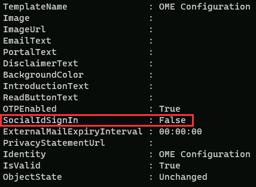

---
lab:
  title: 演習 4 - Microsoft Purview Message Encryption をデプロイする
  module: Module 1 - Implement Information Protection
---

# ラボ 1 - 演習 4 - Microsoft Purview Message Encryption をデプロイする

Contoso Ltd. の情報セキュリティ管理者である Joni Sherman は、部門間の安全な通信を確保する業務を任されています。 これをサポートするため、彼女は、既定の設定の変更や財務部門向けのカスタム ブランド エクスペリエンスの作成など、Contoso 向けに Microsoft Purview Message Encryption を構成しています。

**タスク**:

1. Azure RMS の機能を確認する
1. 既定のブランド テンプレートを修正する
1. 既定のブランド化の動作を検証する
1. カスタム ブランド テンプレートを作成する
1. カスタム ブランド化の動作を検証する

## タスク 1 – Azure RMS の機能を確認する

このタスクでは、テナントの正しい Azure RMS 機能を確認します。

1. 引き続き Client 1 VM (SC-401-CL1) に **SC-401-CL1\admin** アカウントでログインしている必要があります。

1. タスク バーの [スタート] ボタンを右クリックし、**[ターミナル]** を選択して、PowerShell を開きます。

1. ターミナル ウィンドウで**モジュールのインストール** コマンドレットを実行して、最新の **Exchange Online PowerShell** モジュール バージョンをインストールします。

    ```powershell
    Install-Module ExchangeOnlineManagement
    ```

1. 信頼されていないレポジトリ セキュリティ ダイアログで、[はい] を示す **[Y]** を選択して確定し、**Enter** キーを押します。  この処理は、完了までに時間がかかる場合があります。

1. **Connect-ExchangeOnline** コマンドレットを実行し、Exchange Online PowerShell モジュールを使用してテナントに接続します。

    ```powershell
    Connect-ExchangeOnline
    ```

1. **[サインイン]** ウィンドウが表示されたら、`JoniS@WWLxZZZZZZ.onmicrosoft.com` としてサインインします (ZZZZZZ はラボ ホスティング プロバイダーから支給された固有のテナント ID)。 前のラボでリセットした Joni のパスワードを使用します。

1. **Get-IRMConfiguration** コマンドレットを実行して、テナントで Azure RMS と IRM がアクティブになっていることを確認します。

    ```powershell
    Get-IRMConfiguration | fl AzureRMSLicensingEnabled
    ```

   **AzureRMSLicensingEnabled** 結果は **True** にする必要があります。

1. **Test-IRMConfiguration** コマンドレットを実行し、Office 365 Message Encryption を使用して送信者と受信者の両方に **Megan Bowen** を指定し、Azure RMS の機能をテストします。

    ```powershell
    Test-IRMConfiguration -Sender MeganB@contoso.com -Recipient MeganB@contoso.com
    ```

    

    すべてのテストが PASS のステータスであり、エラーが表示されていないことを確認します。

1. PowerShell ウィンドウは開いたままにします。

Exchange Online PowerShell モジュールがインストールされ、テナントに接続し、Azure RMS が正しく機能していることを確認しました。

## タスク 2: 既定のブランド テンプレートを修正する

組織からは Google や Facebook などの ID プロバイダーへの信頼を制限する要件が出されています。 既定では、このようなソーシャル ID はメッセージ暗号化で保護されたメッセージにアクセスするためにアクティブ化されているので、組織内のすべてのユーザーに対してソーシャル ID の利用を非アクティブ化する必要があります。

1. Client 1 VM (SC-401-CL1) には **SC-401-CL1\admin** アカウントでログインし、Exchange Online が接続された状態の PowerShell ウィンドウが開いている必要があります。

1. **Get-OMEConfiguration** コマンドレットを実行して、既定の構成を表示します。

    ```powershell
    Get-OMEConfiguration -Identity "OME Configuration" | fl
    ```

   設定を確認して、SocialIdSignIn プロパティが **[True]** に設定されていることを確認します。

    

1. **Set-OMEConfiguration** コマンドレットを実行し、OME で保護されたテナントからのメッセージにアクセスするためのソーシャル ID の利用を制限します。

    ```powershell
    Set-OMEConfiguration -Identity "OME Configuration" -SocialIdSignIn:$false
    ```

1. 既定のテンプレートをカスタマイズすることに関する警告メッセージを、[はい] を示す **[Y]** を選択して確定し、**Enter** キーを押します。

1. **Get-OMEConfiguration** コマンドレットを実行して、既定の構成をもう一度確認し、検証します。

    ```powershell
    Get-OMEConfiguration -Identity "OME Configuration" | fl
    ```

    

   結果には、SocialIDSignIn が **False** に設定されていることが表示されています。 PowerShell ウィンドウとクライアントは開いたままにします。

ソーシャル ID プロバイダーを正常に無効にし、Contoso からの暗号化された電子メールを Microsoft アカウントまたはワンタイム パスコードを使用してのみ開くことができるようにし、機密性の高いメッセージへのアクセス制御を強化しました。

## タスク 3 – 既定のブランド化動作を検証する

テナントのユーザーから Office 365 Message Encryption で保護されたメッセージを受信するときに、ソーシャル ID ダイアログが外部の受信者に対して表示されていないことを確認する必要があります。暗号化されたコンテンツにアクセスするときはいつでも OTP を使用する必要があります。

> [!alert] 一部のラボ環境では、外部メールの配信がブロックされる場合があります。 このタスクは、想定どおりに完了しない可能性があります。

1. Client 1 VM (SC-401-CL1) には引き続き **SC-401-CL1\admin** アカウントでログインしておきます。

1. InPrivate ウィンドウで **Microsoft Edge** を開くには、タスク バーから Microsoft Edge を右クリックし、**[新しい InPrivate ウィンドウ]** を選択します。

1. **`https://outlook.office.com`** に移動し、Outlook on the web に `LynneR@WWLxZZZZZZ.onmicrosoft.com` としてログインします (ZZZZZZ はラボ ホスティング プロバイダーから支給された固有のテナント ID)。 Lynne のパスワードは、前の演習で設定しました。

1. **[サインインの状態を維持しますか?]** ダイアログボックスで、**[今後、このメッセージを表示しない]** チェックボックスをオンにして、**[いいえ]** を選択します。

1. Outlook on the web で、**[新しいメール]** を選択します。

1. **[To]** に、テナント ドメインには存在しない、個人用またはその他サード パーティのメール アドレスを入力します。 メールの件名に「**`Secret Message`**」と入力し、本文には「**`My super-secret message.`**」と入力します。

1. 上部のペインから **[オプション]** を選択した後、 **[暗号化]** を選択してメッセージを暗号化します。 メッセージが正常に暗号化されると、"このメッセージは暗号化されています。 受信者は暗号化を削除できません" のような通知が表示されるはずです。

      

1. **[送信]** を選択してメッセージを送信します。 Outlook ウィンドウは開いたままにしておきます。

1. 新しいウィンドウで個人用のメール アカウントにサインインし、Lynne Robbins からのメッセージを開きます。 Microsoft アカウント (@outlook.com など) にこのメールを送った場合、暗号化は自動的に行われる可能性があり、メッセージが自動的に表示されます。 メールを他のメール サービス (@gmail.com など) に送信した場合、暗号化を処理し、メッセージを読み取る次の手順を実行する必要がある場合があります。

    > [!Note] **注:** 迷惑メール フォルダーに Lynne Robbins からのメッセージがあるかどうかを確認する必要があるかもしれません。

1. **[メッセージを読む]** を選択します。

1. ソーシャル ID が無効になっているため、サード パーティのアカウントでサインインするオプションは表示されません。

1. **[ワンタイム パスコードを使用してサインイン]** を選択して、制限時間付きパスコードを受け取ります。

1. 個人用のメール ポータルを開き、**"メッセージを表示するためのワンタイム パスコード"** という件名のメッセージを開きます。

1. パスコードをコピーして、OME ポータルに貼り付け、 **[続行]** を選択します。

1. 暗号されたメッセージを確認します。

修正された、既定の OME テンプレートを非アクティブ化したソーシャル ID でテストしました。

## タスク 4 – カスタム ブランド テンプレートを作成する

組織の財務部が送信する、保護されたメッセージには、カスタマイズした導入や本文、フッターの免責事項のリンクなど、特別なブランド化が必要です。 財務のメッセージはまた、7 日経過した後期限切れとします。 このタスクでは、OME 構成を新しくカスタマイズし、財務部が送信するすべてのメールに対しその OME 構成を適用する転送ルールを作成します。

1. Client 1 VM (SC-401-CL1) に引き続き **SC-401-CL1\admin** としてログインしていて、Exchange Online が接続された状態の PowerShell ウィンドウが開いている必要があります。

1. **New-OMEConfiguration** コマンドレットを実行して、新しい構成を作成します。

    ```powershell
    New-OMEConfiguration -Identity "Finance Department" -ExternalMailExpiryInDays 7
    ```

1. テンプレートのカスタマイズに関する警告メッセージを、[はい] を示す **[Y]** を選択して確定し、**Enter** キーを押します。

1. _IntroductionText_ パラメーターを指定して **Set-OMEConfiguration** コマンドレットを実行し、概要テキストを変更します。

    ```powershell
    Set-OMEConfiguration -Identity "Finance Department" -IntroductionText " from Contoso Ltd. finance department has sent you a secure message."
    ```

1. テンプレートのカスタマイズに関する警告メッセージを、[はい] を示す **[Y]** を選択して確定し、**Enter** キーを押します。

1. _EmailText_ パラメーターを指定して **Set-OMEConfiguration** コマンドレットを実行し、暗号化されたメール本文のテキストを更新します。

    ```powershell
    Set-OMEConfiguration -Identity "Finance Department" -EmailText "Encrypted message sent from Contoso Ltd. finance department. Handle the content responsibly."
    ```

1. テンプレートのカスタマイズに関する警告メッセージを、[はい] を示す **[Y]** を選択して確定し、**Enter** キーを押します。

1. _PrivacyStatementURL_ パラメーターを指定して **Set-OMEConfiguration** コマンドレットを実行し、免責事項の URL を Contoso のプライバシーに関する声明ののサイトを示すように変更します:

    ```powershell
    Set-OMEConfiguration -Identity "Finance Department" -PrivacyStatementURL "https://contoso.com/privacystatement.html"
    ```

1. テンプレートのカスタマイズに関する警告メッセージを、[はい] を示す **[Y]** を選択して確定し、**Enter** キーを押します。

1. **New-TransportRul** コマンドレットを実行して、財務チームから送信されるすべてのメッセージにカスタム OME テンプレートを適用するメール フロー ルールを作成します。 この処理は、完了するまでに数秒かかる場合があります。

    ```powershell
    New-TransportRule -Name "Encrypt all mails from Finance team" -FromScope InOrganization -FromMemberOf "Finance Team" -ApplyRightsProtectionCustomizationTemplate "Finance Department" -ApplyRightsProtectionTemplate Encrypt
    ```

1. **Get-OMEConfiguration** コマンドレットを実行して、変更を確認します。

    ```powershell
    Get-OMEConfiguration -Identity "Finance Department" | Format-List
    ```

1. 結果を確認したら PowerShell ウィンドウを閉じます

財務部門からのメールが暗号化され、一貫性のあるブランド化が行われるにようにトランスポート ルールを構成し、Contoso のメッセージングとセキュリティの標準を強化しました。

## タスク 5 – カスタム ブランド化の動作を検証する

新しいカスタム構成を検証するため、財務チームのメンバーである Lynne Robbins のアカウントをもう一度使用する必要があります。

> [!alert] 外部メールの制限により、このメッセージを受信できない場合があります。 ブランド化が想定どおりに表示されない場合があります。

1. Web ウィンドウで InPrivate Outlook を使用して **Microsoft Edge** に移動します。引き続き、**Lynne Robbins** としてログインしている必要があります。

1. Outlook on the web の左上部から **[新しいメール]** を選択します。

1. **[To]** に、テナント ドメインには存在しない、個人用またはその他サード パーティのメール アドレスを入力します。 件名に「**`Finance Report`**」と入力し、メールの本文に「**`Secret finance information.`**」と入力します。

1. **[送信]** を選択してメッセージを送信し、Lynne としてログインしている InPrivate ウィンドウを閉じます。

1. 個人用のメール アカウントにサインインし、Lynne Robbins からのメッセージを開きます。

1. 以下の画像のような Lynne Robbins からのメッセージとなるはずです。  **[メッセージを読む]** を選択します。

    

1. カスタマイズされた構成では、両方の認証オプションが使用可能であり、ソーシャル ID サインインが有効であることを示しています。 **[ワンタイム パスコードを使用してサインイン]** を選択して、制限時間付きパスコードを受け取ります。

1. 個人用のメール ポータルを開き、**"メッセージを表示するためのワンタイム パスコード"** という件名のメッセージを開きます。

1. パスコードをコピーしてポータルに貼り付け、**[続行]** を選択します。

1. カスタム ブランドの暗号化されたメッセージを確認します。 メール アカウントを開いてウィンドウを閉じます。

新しくカスタマイズされたテンプレートが正常にテストされました。
