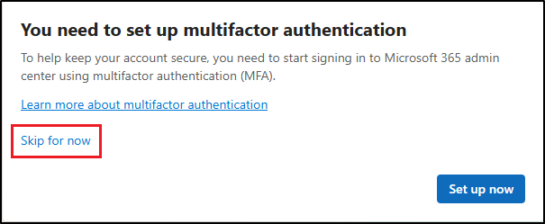

---
lab:
  title: 演習 2 - 適応型保護を実装する
  module: Module 3 - Implement Insider Risk Management
---

# ラボ 3 - 演習 2 - 適応型保護を実装する

あなたは、Contoso Ltd の情報セキュリティ管理者である Joni Sherman です。あなたの役割は、機密データの保護とインサイダー リスクへの対応です。 保護を強化するために、Microsoft Purview の適応型保護を有効にします。これは、インサイダー リスク レベルに基づいてデータ損失防止 (DLP) の実施を動的に調整します。

**タスク**:

1. 適応型保護にインサイダー リスク ポリシーを割り当てる
1. DLP ポリシーの適応型保護設定を構成する
1. 適応型保護を使用して条件付きアクセスを構成する
1. 適応型保護を有効にする

## タスク 1 – 適応型保護にインサイダー リスク ポリシーを割り当てる

1. **SC-401-cl1\admin** アカウントで Client 1 VM (SC-401-CL1) に ログインします。

1. **Microsoft Edge** で、**`https://purview.microsoft.com`** に移動して **Joni Sherman**`JoniS@WWLxZZZZZZ.onmicrosoft.com` としてサインインします (ここで ZZZZZZ はラボ ホスティング プロバイダーから支給された一意のテナント ID です)。

1. Microsoft Purview ポータルで、**[ソリューション]** > **[インサイダー リスク管理]** > **[適応型保護]** の順に移動します。

1. 左側のナビゲーション ウィンドウで、**[インサイダー リスク レベル]** を選択します。

1. **[インサイダー リスク レベル]** ページで、次の手順を実行します。

   - [インサイダー リスク ポリシー] ドロップダウンで、前の演習で作成した **[データ漏洩のクイック ポリシー]** を選択します。
   - 既定のリスク レベルの設定は変更しないでください。
   - **[保存]** を選択します。

インサイダー リスク ポリシーを適応型保護にリンクし、Microsoft Purview 全体で動的なリスクベースのアクションを有効にしました。

## タスク 2 – DLP ポリシーの適応型保護設定を構成する

適応型保護がインサイダー リスク ポリシーにリンクされたので、機密データの共有をブロックすることで、高いリスク レベルに対応するように DLP ポリシーを更新します。

1. Microsoft Purview で、**[ソリューション]** > **[データ損失防止]** > **[ポリシー]** の順に移動します。

1. **[ポリシー]** ページで、前の演習で作成した **[DLP - クレジット カードの保護]** ポリシーのチェック ボックスをオンにし、**[ポリシー編集]** を選択します。

1. [DLP 構成] で、**[高度な DLP ルールのカスタマイズ]** ページが表示されるまで、**[次へ]** を選択します。

1. **[クレジット カード情報ルール]** の横にある鉛筆アイコンを選択して編集します。

1. **[編集ルール]** ページで、次の手順を実行します。
   - **[説明]** フィールドに、`Block sharing of credit card data when user has an elevated insider risk level.` を入力します。
   - **[条件]** セクションで、**[条件の追加]** > **[適応型保護のインサイダー リスク レベルが]** を選択します。
   - 新しいセクションで、**[高いリスク]** を選択します。
   - **[アクション]** で、**[Microsoft 365 の場所のコンテンツへのアクセスまたは暗号化]** を **[すべてのユーザーをブロックする]** に設定します。
   - **[保存]** を選択してルールを更新します。

1. **[詳細な DLP ルールのカスタマイズ]** ページに戻り、**[次へ]** を選択します。

1. **[ポリシー モード]** ページで、ポリシーをアクティブのままにして、**[次へ]** を選択します。

1. **[確認と完了]** ページで、**[送信]** を選択し、ポリシーが更新されたら **[完了]** を選択します。

DLP ポリシーを更新して、インサイダー リスクが高くなったときに共有をブロックし、ユーザーの行動に基づいてデータ保護を強化しました。

## タスク 3: 適応型保護を使用して条件付きアクセスを構成する

適用の別の層を追加するには、インサイダー リスク レベルを使用し、条件付きアクセスを使用してアクセスを制限できます。 このタスクでは、インサイダー リスク レベルが高いユーザーのアクセスをブロックするポリシーを作成します。

1. Microsoft Purview で、Joni のアカウントからサインアウトし、すべてのブラウザー ウィンドウを閉じます。

1. 新しい Microsoft Edge のウィンドウを開き、**Microsoft Entra 管理センター** (`https://entra.microsoft.com`) に移動します。 **MOD 管理者**としてサインインします。`admin@WWLxZZZZZZ.onmicrosoft.com` (ここで ZZZZZZ はラボ ホスティング プロバイダーから支給された一意のテナント ID です)。 管理者のパスワードは、ラボ ホスティング プロバイダーから提供されます。

> [!note] **注**: 一部のテナントでは、サインイン時にポータルの MFA 適用に関するメッセージが表示される場合があります。 このメッセージが表示される場合:
> - **[MFA の延期]** を選択して、MFA のセットアップを一時的に遅らせます。
>
>   
> - **[延期の確認]** を選択します。
>
> - **[MFA を使用せずにサインインを続行]** を選択して Microsoft Entra にアクセスします。
>
> この結果、テナントの MFA 適用が延期され、ラボを進めることができます。

1. Microsoft Entra 管理センターで、**[保護]** > **[条件付きアクセス]** > **[ポリシー]** の順に移動します。

1. **[ポリシー]** ページで **[+ 新しいポリシー]** を選択します。

1. **[新しいポリシー]** ページで、ポリシーに名前を付けます：`Block all access for elevated risk`

1. **[割り当て]** で、**[ユーザー]** セクションを構成します。

   - **含む**: すべてのユーザー  
   - **除外**: `Joni Sherman` と `MOD Administrator`

     ![[条件付きアクセス] でユーザーを除外する場所を示すスクリーンショット。](../Media/ca-exclude-users.png)

1. **[ターゲット リソース]** で、ドロップダウンが **[リソース] (以前の [クラウド アプリ])** に設定されていることを確認し、**[すべてのリソース] (以前の [すべてのクラウド アプリ])** を選択します。

     ![[条件付きアクセス] でターゲット リソースを構成する方法を示すスクリーンショット。](../Media/ca-target-resources.png)

1. **[条件]** で、**[インサイダー リスク]** を選択します。 **[構成]** を **[はい]** に設定し、リスク レベルを **[高い]** に設定します。

     ![[条件付きアクセス] でインサイダー リスク設定を示すスクリーンショット。](../Media/ca-insider-risk-levels.png)

1. **[アクセス制御]** で **[許可]** を選択します。 **[アクセスのブロック]** を選択し、ポップアップの下部で **[選択]** を選択します。

     ![[条件付きアクセス] でアクセスをブロックする場所を示すスクリーンショット。](../Media/ca-block-access.png)

1. ページの下部で、**[ポリシーの有効化]** を **[レポート専用]** に設定し、**[作成]** を選択します。

1. [条件付きアクセス] の **[ポリシー]** ページに戻り、 **[更新する]** を選択して、新しく作成したポリシーが表示されていることを確認します。

1. ウィンドウの右上の MA アイコンを選択し、**[サインアウト]** を選択して MOD 管理者アカウントからサインアウトし、すべてのブラウザー ウィンドウを閉じます。

リスクの高いユーザーのアクセスをブロックする条件付きアクセス ポリシーを作成しました。このポリシーはレポート専用モードであるため、アクセスに直接影響を与えません。

## タスク 4 - 適応型保護を有効にする

この最後のタスクでは、適応型保護を有効にして、システムがインサイダー リスクに基づいて動的な適用を開始できるようにします。

1. **Microsoft Edge** を開き、**`https://purview.microsoft.com`** に移動して、**Joni Sherman**`JoniS@WWLxZZZZZZ.onmicrosoft.com` としてサインインします (ここで ZZZZZZ はラボ ホスティング プロバイダーから支給された一意のテナント ID です)。

1. **[ソリューション]** > **[インサイダー リスク管理]** > **[適応型保護]** に移動します。

1. 構成を確認する

   - **[インサイダー リスク レベル]** タブで **[データ漏洩のクイック ポリシー]** が選択されています。

   - **[条件付きアクセス]** タブに **[リスクの高いユーザーのアクセスをすべてブロックする]** ポリシーが表示されています。

   - **[データ損失防止]** タブに **[DLP - クレジット カード保護ポリシー]** が表示されています。

1. **[適応型保護設定]** タブを選択します。

1. **[適応型保護]** を **[オン]** に切り替え、**[保存]** を選択します。

適応型保護を正常に有効にしました。 適用アクションが、ユーザーのインサイダー リスク レベルに基づいて自動調整されるようになりました。
