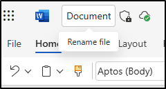

---
lab:
  title: 秘密度、DLP、およびアイテム保持ポリシーを検証する
  module: 'Policy validation - Validate sensitivity, DLP, and retention policies'
---

## WWL テナント - 使用条件

講師が指導するトレーニング配信の一環としてテナントを提供されている場合は、講師が指導するトレーニングでハンズオンラボをサポートする目的でテナントを利用できることに注意してください。

テナントを共有したり、ハンズオンラボ以外の目的で使用したりしないでください。 このコースで使われるテナントは試用版テナントであり、クラスが終了し、拡張機能の対象となっていない場合は、使用したりアクセスしたりすることはできません。

テナントを有料サブスクリプションに変換することはできません。 このコースの一環として取得したテナントは Microsoft Corporation の財産のままであり、当社はいつでもアクセス権とリポジトリを取得する権利を留保します。

# 検証ラボ - 秘密度、DLP、およびアイテム保持ポリシーを検証する

あなたは、Contoso Ltd の情報セキュリティ管理者である Joni Sherman です。秘密度ラベル、データ損失防止 (DLP)、およびアイテム保持ポリシーを構成したので、次にこれらの構成が正常に動作していることを検証するように求められました。 このラボでは、Microsoft 365 アプリの各ポリシーの動作をテストし、ポリシー設定に従ってコンテンツが保護および保持されていることを確認します。

**タスク**:

1. Word で秘密度ラベルを適用する
1. Outlook で DLP ポリシーをトリガーする
1. SharePoint で保持ラベルと機密度ラベルを適用する

## タスク 1 – Word で秘密度ラベルを適用する

このタスクでは、発行された秘密度ラベルがユーザーに対して使用可能になっていて、Microsoft Word から直接適用できることを確認します。

1. 引き続き Client 1 VM (SC-401-CL1) に **SC-401-cl1\admin** アカウントでログインし、Microsoft 365 には **Joni Sherman**`JoniS@WWLxZZZZZZ.onmicrosoft.com` としてログインしている必要があります (ここで ZZZZZZ はラボ ホスティング プロバイダーから支給された一意のテナント ID です)。 Joni のパスワードは、前の演習で設定しました。

1. Microsoft Edge で、左上のアプリ起動ツールを選択し、**[Word]** を選択します。

    ![アプリ起動ツール メニューから [Word] を選択する場所を示すスクリーンショット。](../Media/meatball-menu-word.png)

1. **[空白のドキュメント]** を選択します。

1. プロンプトが表示されたら、**[プライバシー オプション]** ダイアログを閉じます。

1. ドキュメントに次のテキストを入力します。

   `Important HR employee document.`

1. ナビゲーション リボンから **[秘密度]** を選択し、**[社内]** > 、**[従業員データ (HR)]** の順に選択して、新しく作成した秘密度ラベルをこのドキュメントに適用します。

    

    > [!Note] 新しく発行された秘密度ラベルがアプリケーションで使用できるようになるまで、24 から 48 時間かかる可能性があります。 新しく作成した秘密度ラベルを使用できない場合は、この演習では **[機密]** - **[全従業員]** を使用できます。

1. 秘密度ラベルを **[公開]** に変更して、業務上の正当な理由ダイアログが表示されていることを確認します。

1. 秘密度ラベルを保持するには、**[キャンセル]** を選択します。

1. ドキュメントの左上にある **[ドキュメント]** を選択し、このファイルの名前を **`HR Document`** に変更します。 Enter キーを押して、この名前の変更を適用します。

    

人事部門の機密度ラベルが使用可能であることを確認し、Word ドキュメントに適切な保護を適用しました。

## タスク 2 – Outlook で DLP ポリシーをトリガーする

次に、従業員の機密情報をメールで送信して、DLP ポリシーによってアクティビティが正しく検出され、ブロックされていることを確認します。

1. Client 1 VM (SC-401-CL1) には引き続き **SC-401-CL1\admin** アカウントでログインし、Microsoft 365 には Joni Sherman としてログインしている必要があります。

1. Microsoft Edge で、左上のアプリ起動ツールを選択し、**Outlook** を選択します。

1. 左上にある **[新しいメール]** ボタンを選択して、新しいメール メッセージを作成します。

1. **[宛先]** フィールドに「`Megan`」と入力し、**Megan Bowen** のメール アドレスを選択します。

1. [件名] フィールドに「`Help with employee information`」と入力します。

1. メールの本文には、次の内容を入力します。

   ``` text
   Please help me with the start dates for the following employees:
   ABC123456
   DEF678901
   GHI234567

   Thank you, 
   Joni Sherman
   ```

1. メッセージ ウィンドウの右上にある **[送信]** ボタンを選択して、メールを送信します。

1. メールが配信不能であり、DLP ポリシーによってブロックされたことを示すメッセージを受信します。

   ![[ロールの管理] オプションのスクリーンショット。](../Media/dlp-email-blocked.png)

DLP ポリシーによって、機密情報である従業員 ID のメールによる送信がブロックされたことを確認しました。

## タスク 3 – SharePoint で保持ラベルと機密度ラベルを適用する

保持の構成をテストするには、SharePoint に保存されているドキュメントに保持ラベルを適用し、秘密度ラベルも使用可能になってることを確認します。

1. Client 1 VM (SC-401-CL1) には引き続き **SC-401-CL1\admin** アカウントでログインし、Microsoft 365 には Joni Sherman としてログインしている必要があります。

1. Microsoft Edge で、左上のアプリ起動ツールを選択し、**[SharePoint]** を選択します。

1. SharePoint ランディング ページで、「`Benefits`」を検索し、検索結果から **Benefits @ Contoso** を選択します。

1. 左側のウィンドウで **[ドキュメント]** を選択します。

1. **[ドキュメント]** ページで、**Profit-sharing Plan.docx** の横にある省略記号を選択し、**[詳細]** を選択します。

   

1. **[詳細]** パネルで、次のフィールドを更新します。
   - **秘密度**: 社外秘 - 財務
   - **ラベルの適用**: 機密性の高い財務記録

     

保持ラベルと秘密度ラベルが使用可能であり、SharePoint ドキュメントに適用できることを確認しました。
